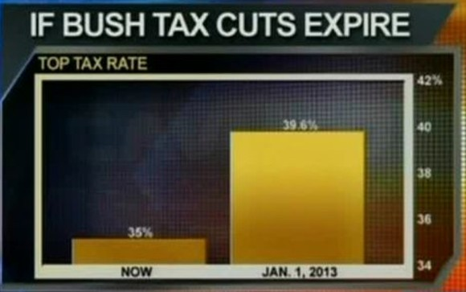
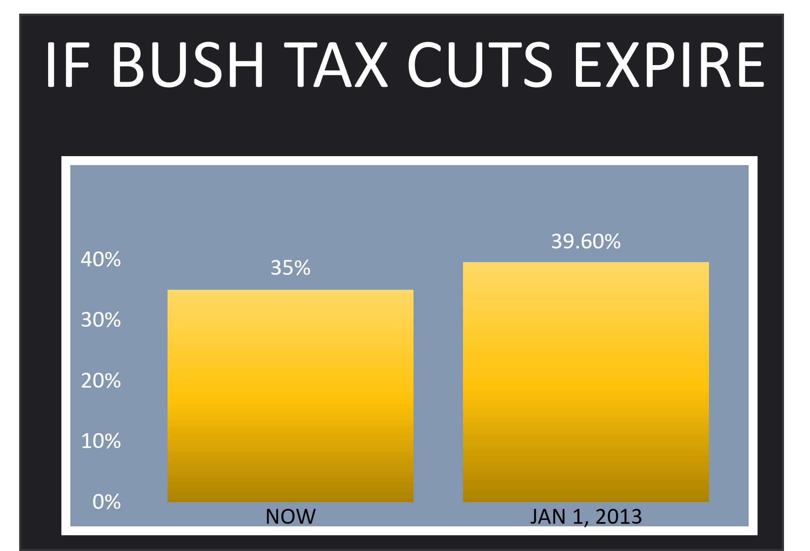
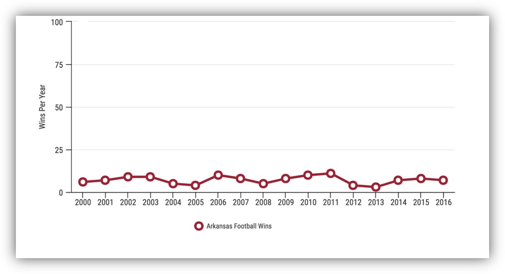
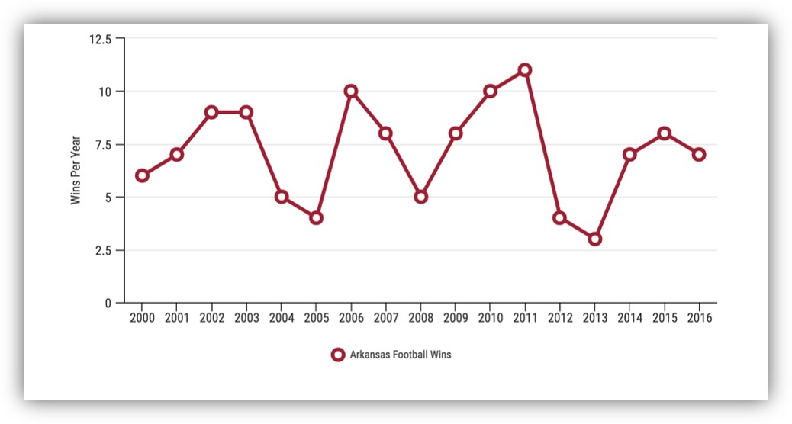
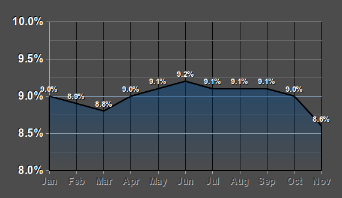
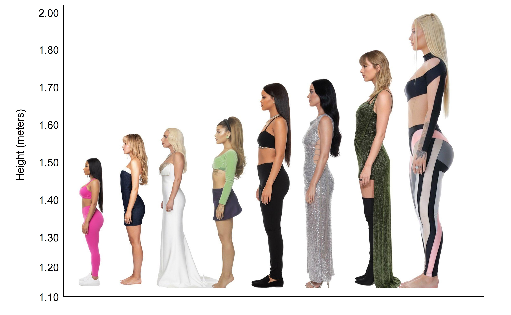
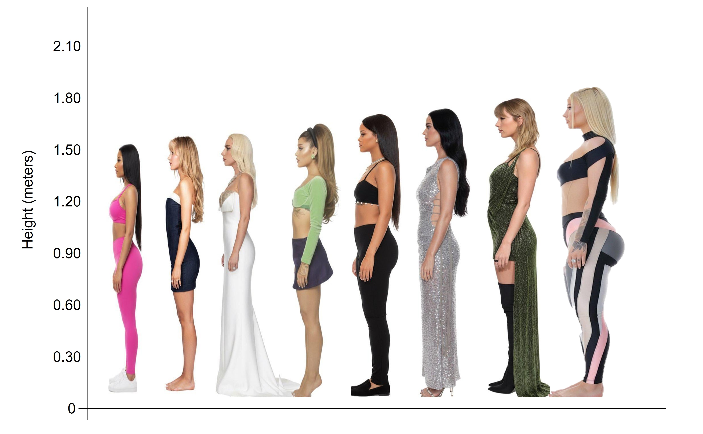
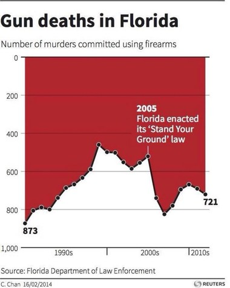
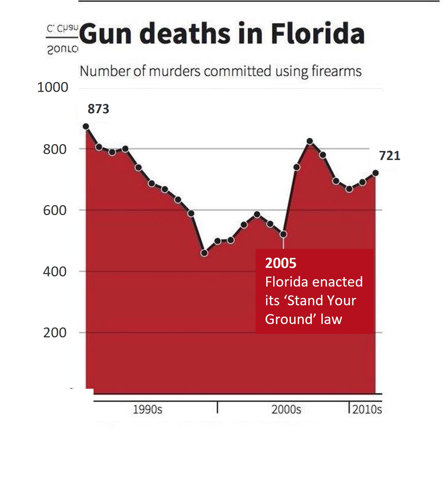
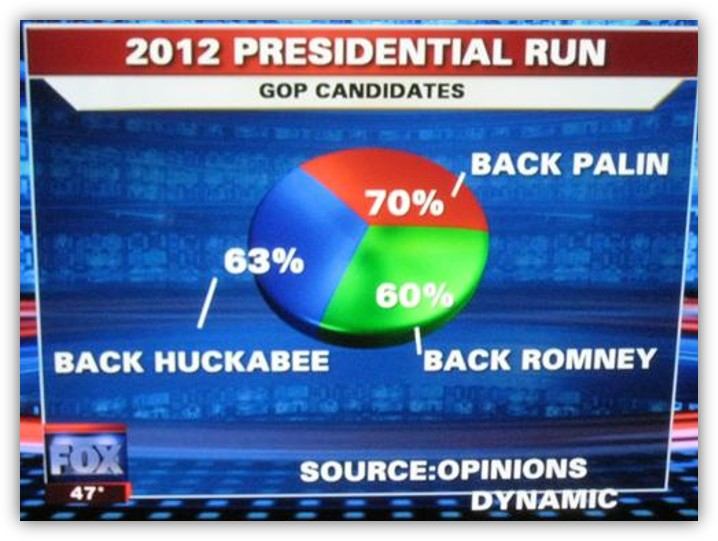

```{r, echo=FALSE, message=FALSE, warning=FALSE}
library(ggplot2)
library(patchwork)
```


::: {.tag-list}
[Data Visualisation]{.tag}
[Misleading Graphs]{.tag}
[Critical thinking]{.tag}
:::

## About

This activity turns students into data detectives. By examining real graphs that have been published in the news, on social media, or in official reports, students learn to spot the tricks — truncated axes, misleading scales, cherry-picked data, poor chart choices — that can distort how a graph is interpreted. The activity builds critical data literacy skills while reinforcing what makes a graph *good* by contrast.

## Demonstration

## Materials

- A collection of real "bad graph" examples (screenshots or links) sourced from news articles, social media, or reports
- A tool for students to respond in real time or in small groups (e.g. Google Forms, Padlet, or simple discussion)

Here are some that I have found (mostly from Fox News)

::: {.panel-tabset}

## Original

<center>{width="600px"}</center>

## Revisions

<center>{width="600px"}</center>

:::

::: {.panel-tabset}

## Original

<center>{width="600px"}</center>

## Revisions

<center>{width="600px"}</center>

:::

::: {.panel-tabset}

## Original

<center>{width="600px"}</center>

## Revisions

<center>{width="600px"}</center>

:::

::: {.panel-tabset}

## Original

<center>{width="600px"}</center>

## Revisions

<center>{width="600px"}</center>

:::

::: {.panel-tabset}

## Original

<center>{width="600px"}</center>

## Revisions

<center>{width="600px"}</center>

:::

::: {.panel-tabset}

## Original

<center>{width="600px"}</center>

## Revisions

This one here looks like people were allowed to choose multiple options (I think that's why it exceeds 100%). Choose a different type of graph.

:::


## Step-by-Step Plan

### 0 (Pre-tasks)

- Curate 4–6 examples of poorly constructed or misleading graphs (truncated y-axis, dual axes, 3D pie charts, cherry-picked timeframes, etc.)
- For each graph, prepare the correct or redrawn version if possible, to reveal later
- Optionally set up a short form or worksheet with prompts like "What is this graph trying to tell you?" and "What's actually misleading about it?"

### 1 (Setup)

In class (face-to-face or online), display the first graph and say:

> "This graph was published in [source]. Take 30 seconds — what's your first impression? What story does it seem to tell?"

### 2 (Collect responses)

Have students jot down or submit their first impression of each graph before any discussion — this captures the "gut reaction" the graph was designed to produce.

### 3 (Diagnose the problem)

Work through each graph as a class or in small groups, identifying the specific technique used to mislead (e.g. truncated axis exaggerating a trend, inconsistent bin widths, area encoding that distorts proportions). Introduce the relevant vocabulary as it comes up.

### 4 (Redraw / Fix)

Show a corrected version of the graph (or challenge students to sketch one) using the same data. Discuss how the story changes once the distortion is removed.

### 5 (Reveal)

Reveal the source and context of the original graph, including any explanation from the publisher (if available) or the pushback it received online. Discuss why these distortions are so common — intentional persuasion vs. simple carelessness.

## Bonus / Optional:

- Can relate this activity to critical evaluation of data reporting more broadly
- After working through the curated set, try a few extensions:
    - **Student-sourced examples:** Ask students to find and submit their own "bad graph" from the past week — from news, social media, or advertising — for the next class.
    - **Redesign challenge:** Give students the raw data behind one bad graph and have them redesign the chart from scratch, following good visualisation principles.
    - **Rank the offenders:** Have students rank the examples from "misleading but minor" to "actively deceptive," and defend their ranking — this opens discussion about intent vs. impact.
    - **Compare to a good graph:** Show a well-designed graph on a similar topic and discuss what specific choices make it trustworthy and clear.