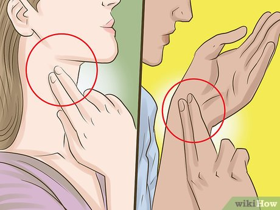

::: {.tag-list}
[Within-Subjects Design]{.tag}
[Paired Design]{.tag}
[Repeated Measures ANOVA]{.tag}
[Physiological Data]{.tag}
:::

## About

This activity turns the whole class into their own control group. Each student measures their own resting heart rate as a baseline, then watches three short video clips designed to trigger different emotional states: fear, sadness, and arousal, recording their heart rate after each one. Because every student contributes a baseline *and* three follow-up measurements, this is a live, hands-on introduction to within-subjects (repeated measures) design, where each participant acts as their own control, removing a lot of the between-person variability that a between-subjects design would have to deal with.

## Demonstration

## Materials

- A visible countdown timer (60s, or 30s if you want a quicker task — see Step 2)
- 3 short (~1 minute) video clips, one each for fear, sadness, and arousal (see Pre-tasks)
- A way to dim/turn off the lecture hall lights, for added atmosphere during the fear and sadness clips
- A tool for students to record their heart rate readings after each stage (e.g. Google Forms, or a simple show-of-hands/paper tally if you'd rather keep it low-tech)
- Optional: a pre-prepared dataset from a previous run of this activity, for the within-subjects ANOVA walkthrough in Step 6

## Step-by-Step Plan

### 0 (Pre-tasks)

- Select a ~1 minute fear clip (plenty available on YouTube — jump-scare compilations or horror clip snippets work well)
- Select a ~1 minute sad clip (a well-known emotional film scene works well here)
- Decide how you'll handle the "arousal" stimulus — see the note in Step 5
- Set up your countdown timer and data collection form in advance
- If using a pre-prepared dataset for Step 6, have it ready to load and analyse live

### 1 (Setup)

Explain the activity to the class:

> "Today you're the data. We're going to measure your heart rate at rest, and then again after three short video clips designed to trigger different emotions. Everyone will have a baseline measurement and three follow-up measurements — so each of you is essentially your own control group."

Show students how to find their pulse — usually at the wrist (radial artery, on the thumb side) or the neck (carotid artery, just beside the windpipe).

### 2 (Baseline Heart Rate)

Have students sit quietly and locate their pulse. Start the 60-second countdown timer on screen and say "start." When the timer hits zero, say "stop."

> If you're short on time, a 30-second count multiplied by 2 works almost as well for a classroom demonstration — it doesn't need to be clinically precise, just a consistent baseline.

Have students record their baseline heart rate (beats per minute).

### 3 (Stimulus 1 — Fear)

Dim or turn off the lights for effect. Play the fear clip.

Immediately afterward, have students find their pulse again and re-time (60s or 30s x2, matching whatever method you used for the baseline). Record heart rate as "Fear."

### 4 (Stimulus 2 — Sadness)

Play the sad clip (lights can stay dimmed for continued effect).

Repeat the same heart rate measurement process. Record heart rate as "Sadness."

### 5 (Stimulus 3 — Arousal)

For the arousal condition, say something like:

> "I have to keep this class PG-rated, so for this one, just close your eyes and imagine whatever you'd like for the next minute."

This usually gets a laugh and works surprisingly well as a stand-in stimulus without needing any actual video content.

Repeat the heart rate measurement process. Record heart rate as "Arousal."

### 6 (Analyse as a Class)

Compile the four measurements per student (Baseline, Fear, Sadness, Arousal) into a single dataset — either using the class's live data or a pre-prepared dataset from a previous run, if you'd rather not wait on data entry.

::: {.callout-note collapse="false"}
## Why this is a within-subjects design

Because every student contributes a measurement under *all four* conditions, each student acts as their own control. This removes between-person variability (e.g. some people naturally have higher resting heart rates than others) from the comparison, making it much easier to detect whether the *stimuli themselves* caused a change — a key advantage of paired/within-subjects designs over between-subjects designs.
:::

Start with the simplest comparison — baseline vs. one stimulus — using a paired t-test:

$$
t = \frac{\bar{d}}{s_d / \sqrt{n}}
$$

where:

- $\bar{d}$ = mean of the differences (stimulus heart rate − baseline heart rate) across students
- $s_d$ = standard deviation of those differences
- $n$ = number of students

Then extend to comparing all three stimuli at once using repeated measures ANOVA:

$$
F = \frac{MS_{\text{condition}}}{MS_{\text{error}}}
$$

where $MS_{\text{condition}}$ captures variability *between* the fear/sadness/arousal conditions, and $MS_{\text{error}}$ captures the leftover within-subject variability once each student's own baseline tendency has been accounted for.

### 7 (Discuss)

Ask the class:

- Which condition produced the biggest average increase from baseline? Does that match what you'd expect physiologically?
- Was the change consistent across students, or did some people barely react while others spiked?
- Why might a *between-subjects* version of this experiment (different groups of students each watching only one clip) be a noisier, less reliable design than what we just did?

## Bonus / Optional:

- Can relate this activity to effect size and individual variability
- A few extensions to try:
    - **Order effects:** Discuss what might happen if every class always watched fear → sadness → arousal in the same order — could earlier stimuli "carry over" and affect later readings? Introduce the idea of counterbalancing as a solution.
    - **Effect size:** Beyond just significance, calculate Cohen's $d$ for one of the paired comparisons to discuss *how large* the heart rate change was, not just whether it was statistically detectable.
    - **Individual differences:** Plot each student's four measurements as a connected line (a "spaghetti plot") to show how much the *pattern* of response varies person to person, even when the average trend is consistent.
    - **Post-hoc comparisons:** If the repeated measures ANOVA is significant, discuss why you can't just conclude "the conditions differ" — introduce pairwise post-hoc tests (e.g. Bonferroni-corrected paired t-tests) to identify *which* specific conditions differ from each other.