::: {.tag-list}
[Inter-Rater Reliability]{.tag}
[Cohen's Kappa]{.tag}
[Agreement]{.tag}
[Categorical Data]{.tag}
:::

## About

This activity uses movie posters to introduce inter-rater reliability, a core concept whenever multiple people (raters, judges, coders) are asked to classify the same thing and you need to know how much their judgments actually agree. Students are shown a series of obscure, mostly unknown movie posters with the title blacked out, and simply guess the genre from the visual alone. Because nobody actually knows the "correct" answer, this isn't really about accuracy — it's about how consistently different people converge on the same interpretation, which is exactly the question Cohen's Kappa is built to answer.

## Demonstration

## Materials

- 10 movie posters from fairly obscure/arthouse films (title and any obvious genre text blacked out or cropped out). Below are some samples:

::: panel-tabset

### Poster Redacted

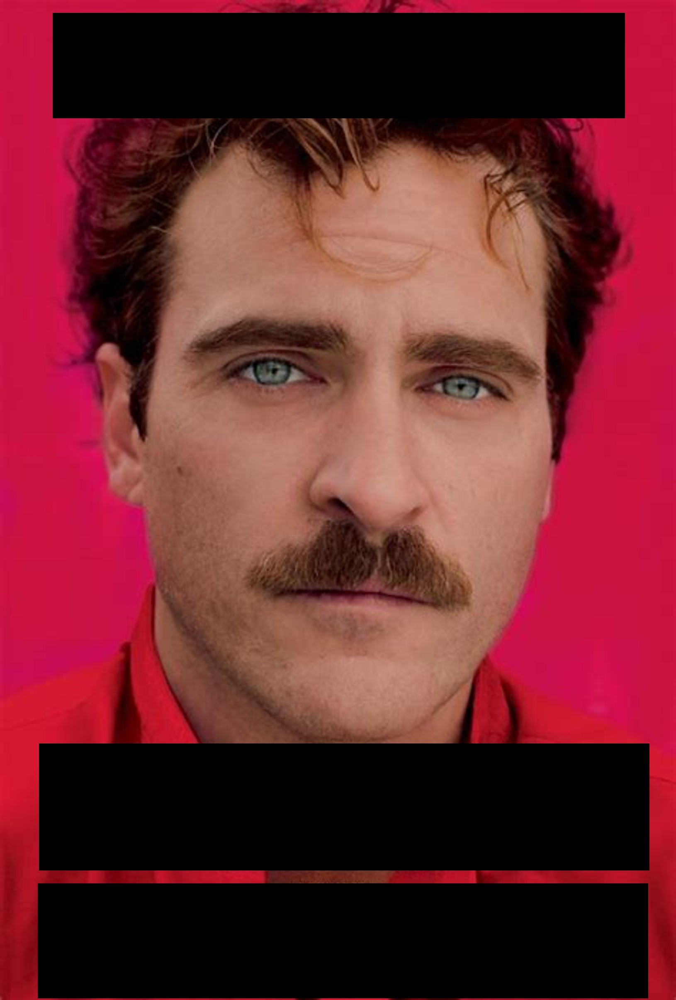{width=50%}

### Poster Revealed

**Drama**

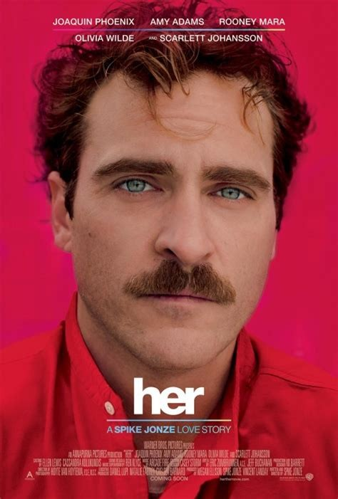{width=50%}

:::

::: panel-tabset

### Poster Redacted

{width=50%}

### Poster Revealed

**Science Fiction**

{width=50%}

:::

::: panel-tabset

### Poster Redacted

{width=50%}

### Poster Revealed

**Comedy**

{width=50%}

:::

::: panel-tabset

### Poster Redacted

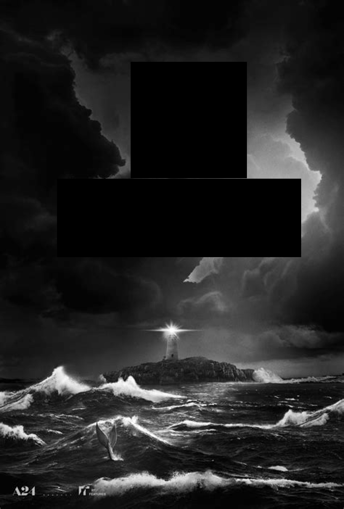{width=50%}

### Poster Revealed

**Thriller**

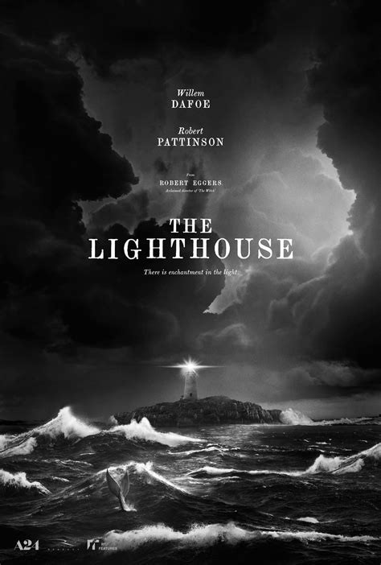{width=50%}

:::

::: panel-tabset

### Poster Redacted

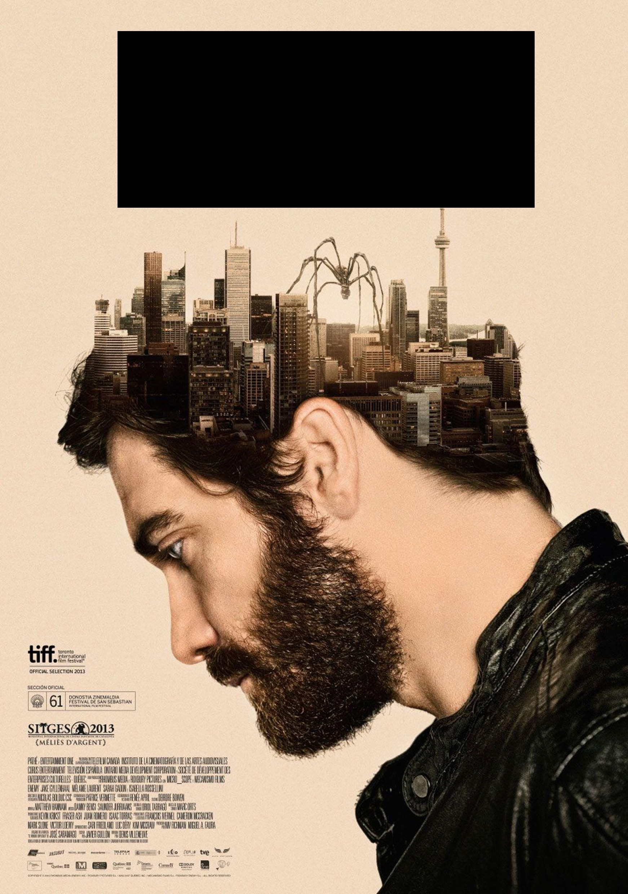{width=50%}

### Poster Revealed

**Thriller**

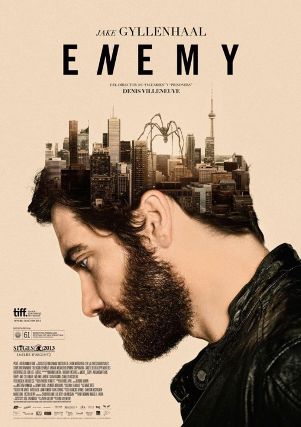{width=50%}

:::

::: panel-tabset

### Poster Redacted

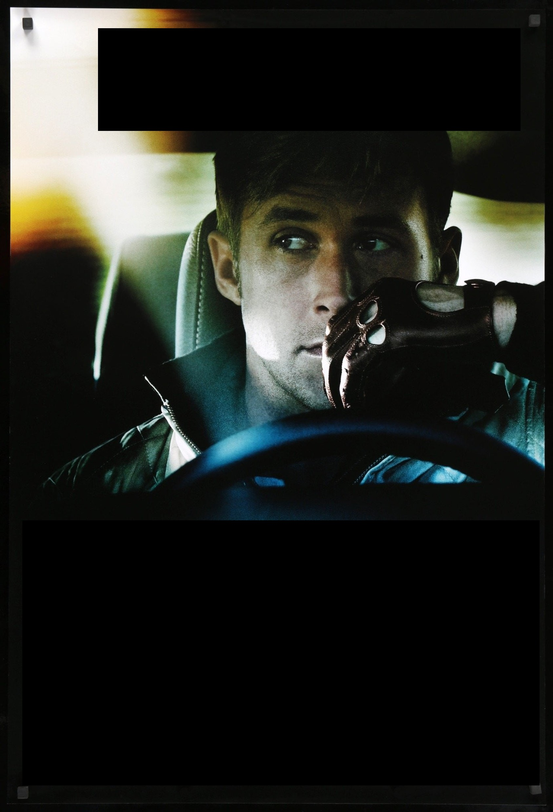{width=50%}

### Poster Revealed

**Action**

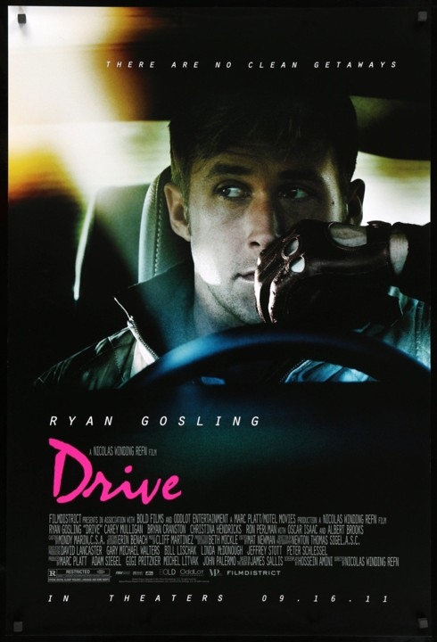{width=50%}

:::

::: panel-tabset

### Poster Redacted

{width=50%}

### Poster Revealed

**Fantasy**

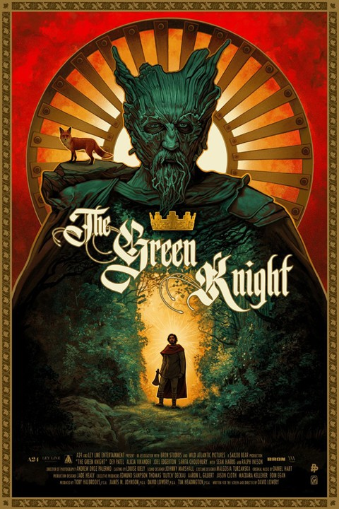{width=50%}

:::

::: panel-tabset

### Poster Redacted

{width=50%}

### Poster Revealed

**Horror**

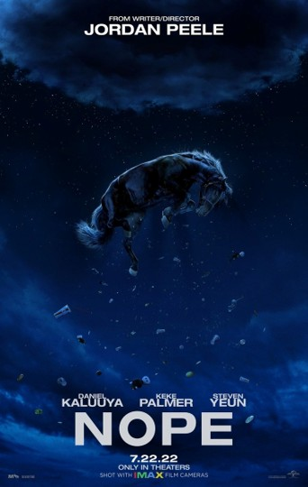{width=50%}

:::

::: panel-tabset

### Poster Redacted

{width=50%}

### Poster Revealed

**Horror**

{width=50%}

:::

::: panel-tabset

### Poster Redacted

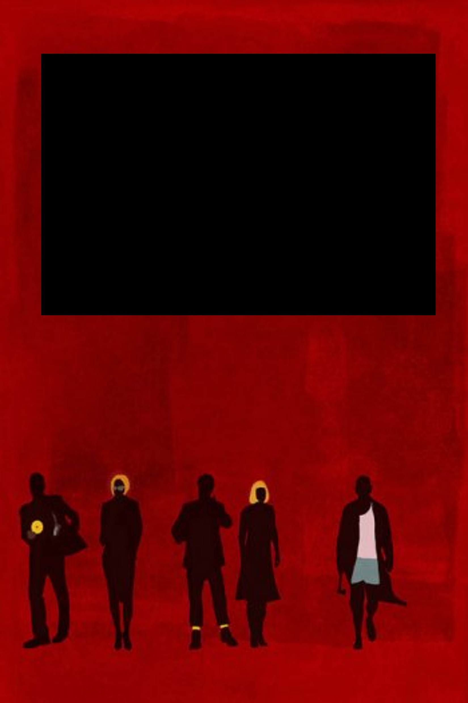{width=50%}

### Poster Revealed

**Comedy**

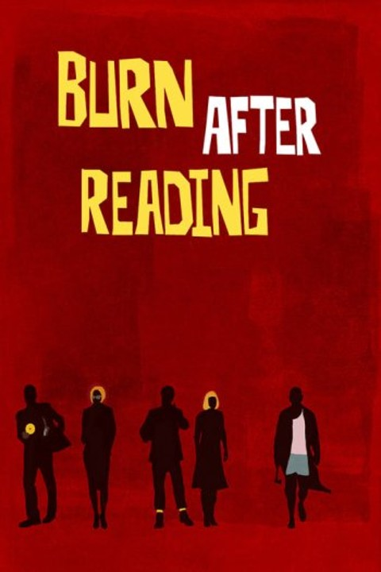{width=50%}

:::

- A tool for students to submit their genre guess per poster (e.g. Google Forms)
- A fixed, shared list of genre categories for students to choose from (e.g. Horror, Comedy, Drama, Thriller, Romance, Sci-Fi)
- A spreadsheet or R session set up to calculate agreement statistics live

## Step-by-Step Plan

### 0 (Pre-tasks)

- Select 10 movie posters, ideally from lesser-known or foreign/arthouse films — the less recognisable the film, the more the guesses reflect genuine visual interpretation rather than prior knowledge
- Edit each poster to remove the title, tagline, and any text that gives away the genre directly (e.g. "A Hilarious New Comedy")
- Decide on a fixed set of genre categories in advance, so every student is choosing from the same options (open-ended text responses are much harder to score for agreement)
- Set up the submission form with one question per poster, using the same category list each time

### 1 (Setup)

Display the first poster and explain the task:

> "I'm going to show you 10 movie posters, one at a time. The titles have been removed. I just want you to guess the genre, based purely on what you see. There's no 'correct' answer I'm expecting — I'm actually more interested in whether you all *agree* with each other than whether you're right. Note: some movies can have multiple genres, just pick what you think is the **main** one."

### 2 (Collect Judgments)

Show each poster for a fixed amount of time (e.g. 15–20 seconds), and have students submit their genre guess before moving to the next one. Repeat for all 10 posters.

### 3 (Reveal the Films)

Once all judgments are collected, reveal the actual title and genre of each film. Let the class react to how close (or far off) their guesses were, but keep the focus on the next step — this reveal is mostly for fun/context, not the main statistical point.

### 4 (Explore Agreement — Two Raters)

Pick any two students at random and compare their 10 genre guesses side by side.

::: {.callout-note collapse="false"}
## Simple (Naive) Percent Agreement

$$
P_o = \frac{\text{Number of posters both raters agreed on}}{\text{Total number of posters}}
$$

This is the most intuitive way to measure agreement, but it has a major flaw: two raters could agree by pure chance, especially if one genre (e.g. "Drama") is a common guess. Percent agreement doesn't account for this.
:::

### 5 (Introduce Cohen's Kappa)

Cohen's Kappa corrects for the agreement we'd expect by chance alone, giving a more honest measure of how much two raters *actually* agree beyond guessing.

::: {.callout-note collapse="false"}
## Formula: Cohen's Kappa

$$
\kappa = \frac{P_o - P_e}{1 - P_e}
$$

where:

- $P_o$ = observed proportion of agreement (from Step 4)
- $P_e$ = expected proportion of agreement by chance, calculated from the marginal proportions of each genre each rater used

$$
P_e = \sum_{i} p_{A_i} \cdot p_{B_i}
$$

where $p_{A_i}$ and $p_{B_i}$ are the proportion of times Rater A and Rater B each chose genre $i$.
:::

Walk through the calculation live using your two selected students' data, building the confusion matrix (a genre-by-genre table of who guessed what) on the board first, since $P_e$ depends on it directly.

### 6 (Interpret Kappa)

Discuss what the resulting $\kappa$ value actually means:

| Kappa Range | Interpretation |
|---|---|
| < 0 | Worse than chance agreement |
| 0.01 – 0.20 | Slight agreement |
| 0.21 – 0.40 | Fair agreement |
| 0.41 – 0.60 | Moderate agreement |
| 0.61 – 0.80 | Substantial agreement |
| 0.81 – 1.00 | Almost perfect agreement |

Ask the class: does the calculated $\kappa$ feel surprising, given how confident individual students may have felt about their own guesses?

### 7 (Scale Up — Whole Class Agreement)

Two raters is a nice starting point, but the real dataset involves the whole class. Introduce **Fleiss' Kappa** as the extension of Cohen's Kappa to more than two raters, and calculate it for the full class's judgments on all 10 posters.

::: {.callout-note collapse="false"}
## Formula: Fleiss' Kappa (concept)

$$
\kappa = \frac{\bar{P} - \bar{P_e}}{1 - \bar{P_e}}
$$

where $\bar{P}$ is the mean observed agreement across all posters and raters, and $\bar{P_e}$ is the mean expected agreement by chance, calculated from how often each genre was chosen overall across the whole class.
:::

Discuss how this whole-class $\kappa$ compares to the two-student value calculated earlier — is agreement higher or lower once everyone is included?

## Bonus / Optional:

- Can relate this activity to real-world applications of inter-rater reliability
- A few extensions to try:
    - **Poster-by-poster breakdown:** Calculate agreement separately for each of the 10 posters — which posters had the highest agreement, and which were the most contested? Discuss what visual features might drive consensus versus disagreement.
    - **Real-world context:** Discuss where inter-rater reliability actually matters in practice — e.g. medical diagnoses from imaging, essay grading, content moderation, or coding qualitative interview data — and why researchers report kappa values in these settings.
    - **Chance agreement demo:** Show what happens to $\kappa$ if two "raters" guessed completely randomly (simulate this) — it should hover near 0, even though raw percent agreement might still look moderately high by chance alone.
    - **Weighted kappa:** For genres that are "closer" to each other (e.g. Thriller vs. Horror) versus totally different (e.g. Comedy vs. Horror), introduce weighted kappa, which penalises near-miss disagreements less than totally opposite ones.